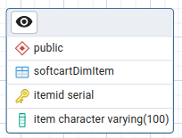

# Module 1: Build a Data Warehouse

## Data Warehouse Design and Setup
### Assignment Overview: Data Warehouse Design & Setup

### Task 1: Design the dimension table softcartDimDate
| Field | Description |
|----------|----------|
| dateid   | The id of the date (Primary key) |
| date   | The date (20-Feb-21)  |
 weekday   | The day number in the week (from 1 to 7) |
| weekdayname  | The name of the day in the week (from Monday to Sunday)|
| month | The month number (from 1 to 12) |
| monthname | The name of the month (from January to December) |
| quarter   | The quarter number (1, 2, 3 or 4) |
| quartername   | The name of the quarter (Q1, Q2, Q3 or Q4) |
| year   | The year (2022, 2023 for examples) |

### Task 2: Design the dimension table softcartDimCategory

| Field | Description |
|----------|----------|
| categoryid   | The id of the category (Primary key) |
| category   | The category (Movie, Ebook, Song for examples) |

### Task 3: Design the dimension table softcartDimItem

| Field | Description |
|----------|----------|
| itemid   | The id of the item (Primary key) |
| item   | The item (The Matrix, The Alchemist, Baby Shark, THe Lord of the Rings for examples) |

### Task 4 - Design the dimension table softcartDimCountry
| Field | Description |
|----------|----------|
| countryid   | The id of the country (Primary key) |
| country  | The name of the country (USA, Canada, Japan, Cyprus for examples) |

### Task 5 - Design the fact table softcartFactSales
| Field | Description |
|----------|----------|
| orderid   | The order id (Primary key) |
| price  | The quantity of waste colleted in tons (9.99, 5.99, 2.49, 6.99 for examples)  |
|dateid   | The  date id (foreign key) |
|categoryid   | The id of the category (Foreign key) |
| itemid   | The id of the item (Foreign key) |
| countryid   | The id of the country (Foreign key) |

## Data Warehouse Reporting
### Assignment Overview: Data Warehouse Reporting

