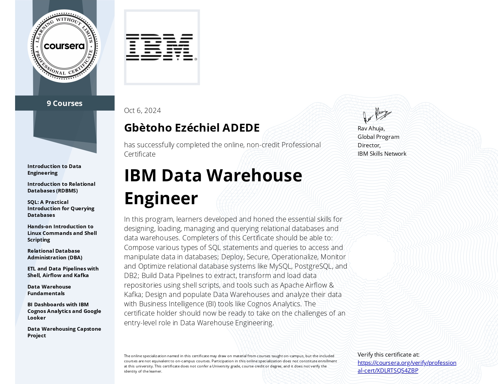

# IBM Data Warehouse Engineer Professional Certificate

## Summary

[The IBM Data Warehouse Engineer Professional Certificate](https://www.coursera.org/professional-certificates/data-warehouse-engineering) is a comprehensive program offered by IBM through Coursera that equips learners with the skills and knowledge required to design, build, and manage data warehouses. Throughout the nine courses, participants gain hands-on experience in areas such as data engineering, relational databases, SQL, Linux commands, ETL pipelines, data warehouse fundamentals, and business intelligence dashboards using IBM Cognos and Google Looker. The program concludes with a capstone project that enables learners to apply their acquired skills to real-world scenarios.

## Achievement

[Verify on Coursera](https://coursera.org/verify/professional-cert/XDLRTSQS4ZBP)

## Key Skills Acquired
- Data Engineering Concepts and Architecture
- Relational Database Design and Administration
- SQL for Database Querying
- Linux Commands and Shell Scripting
- ETL Pipelines and Automation with Airflow and Kafka
- Data Warehouse Design and Optimization
- Business Intelligence Dashboard Development with IBM Cognos and Google Looker

## Tools and Technologies
- IBM Db2
- PostgreSQL
- Apache Airflow
- Apache Kafka
- IBM Cognos Analytics
- Google Looker
- Linux Shell

## Course Notes
### Course 1: Introduction to Data Engineering

[Link](./Course1/)

### Course 2: Introduction to Relational Databases

[Link](./Course2/)

### Course 3: SQL: A Practical Introduction for Querying Databases

[Link](./Course3/)

### Course 4: Hands-on Introduction to Linux Commands and Shell Scripting

[Link](./Course4/)

### Course 5: Relational Database Administration (DBA)

[Link](./Course5/)

### Course 6: ETL and Data Pipelines with Shell, Airflow and Kafka

[Link](./Course6/)
### Course 7: Data Warehouse Fundamentals
[Link](./Course7/)

### Course 8: BI Dashboards with IBM Cognos Analytics and Google Looker

[Link](./Course8/)

### Course 9: Data Warehousing Capstone Project

[Link](./Course9/)
